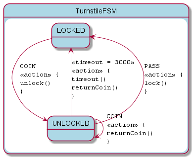

# KFSM for KVision Demo

This is demonstration of using KFSM to create an FSM for use in the UI.
We are using the classic Turnstile FSM. The UI provides for creating multiple instances.

## Resource Processing
* generatePotFile - Generates a `src/main/resources/i18n/messages.pot` translation template file.
## Running
* run - Starts a webpack dev server on port 3000.

## FSM Visualisation

This project also demonstrates how to configure the `kfsm-viz-plugin` to create a state diagram and [state map](turnstile.html).

